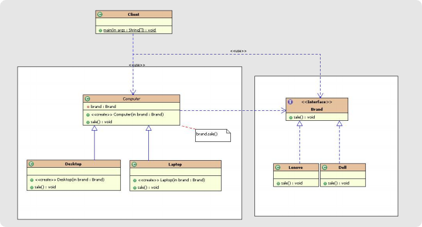

# 核心要点： 
   处理多层继承结构，处理多维度变化的场景，将各个维度设计成独立 的继承结构，使各个维度可以独立的扩展在抽象层建立关联。

# 桥接模式总结
* 桥接模式可以取代多层继承的方案。 多层继承违背了单一职责原则， 复用性较差，类的个数也非常多。桥接模式可以极大的减少子类的个 数，从而降低管理和维护的成本。 
* 桥接模式极大的提高了系统可扩展性，在两个变化维度中任意扩展一 个维度，都不需要修改原有的系统，符合开闭原则。
    
<< 就像一个桥，将两个变化维度连接起来。 各个维度都可以独立的变化。 故称之为：桥模式

# 使用案例

# 实际开发中应用场景
* JDBC驱动程序 
* AWT中的Peer架构 
* 银行日志管理： 
    * 格式分类：操作日志、交易日志、异常日志 
    * 距离分类：本地记录日志、异地记录日志 
* 人力资源系统中的奖金计算模块： 
    * 奖金分类：个人奖金、团体奖金、激励奖金。 
    * 部门分类：人事部门、销售部门、研发部门。 
* OA系统中的消息处理： 
    * 业务类型：普通消息、加急消息、特急消息 
    * 发送消息方式：系统内消息、手机短信、邮件
