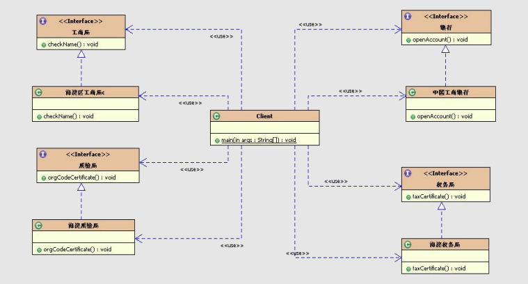

# 核心作用：
为子系统提供统一的入口。封装子系统的复杂性，便于客户端调用。

#  基本案例 
 * 注册公司流程(不使用外观模式)
 
 
 * 注册公司流程(使用外观模式)
 
 
 
 # 开发中常见的场景
 频率很高。哪里都会遇到。
 各种技术和框架中，都有外观模式的使用。
 如：
 * JDBC封装后的
 * commons提供的DBUtils类
 * Hibernate提供的工具类
 * Spring JDBC工具类等