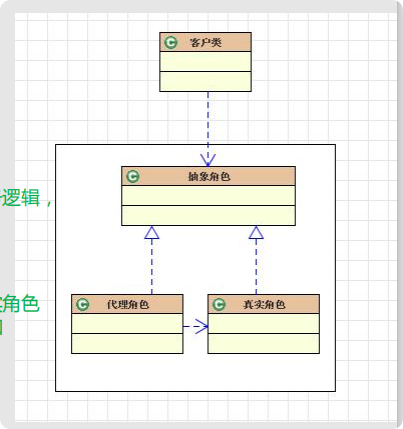
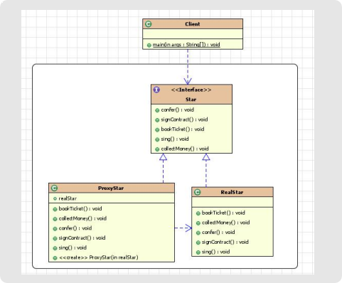
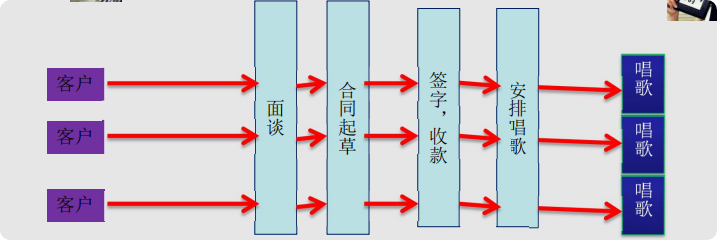

# 核心作用
* 通过代理，控制对对象的访问！ 可以详细控制访问某个（某类）对象的方法，在调用这个方法前做前置处理，调用这个方法后 做后置处理。（即：AOP的微观实现！）
* AOP(Aspect Oriented Programming面向切面编程)的核心实现机制！

# 案例

* 核心角色： 
    * 抽象角色 
        定义代理角色和真实角色的公共对外方法 
    * 真实角色 
        实现抽象角色，定义真实角色所要实现的业务逻辑， 供代理角色调用。 
      – 关注真正的业务逻辑！ 
    * 代理角色 
      * 实现抽象角色，是真实角色的代理，通过真实角色 的业务逻辑方法来实现抽象方法，并可以附加 自己的操作。 
      * 将统一的流程控制放到代理角色中处理！
# 应用场景
* 安全代理：屏蔽对真实角色的直接访问。
* 远程代理：通过代理类处理远程方法调用(RMI)
* 延迟加载：先加载轻量级的代理对象，真正需要再加载真实对象。
    * 比如你要开发一个大文档查看软件，大文档中有大的图片，有可能一个图片有100MB，在打开文件时不可能将所有的图片都显示出来，这样就可以 使用代理模式，当需要查看图片时，用proxy来进行大图片的打开。

# 分类
* 静态代理(静态定义代理类) 
* 动态代理(动态生成代理类)
    * JDK自带的动态代理 
    * javaassist字节码操作库实现 
    * CGLIB 
    * ASM(底层使用指令，可维护性较差)

* JDK自带的动态代理
    * java.lang.reflect.Proxy
        * 作用：动态生成代理类和对象
    * java.lang.reflect.InvocationHandler(处理器接口)
        * 可以通过invoke方法实现对真实角色的代理访问。 
        * 每次通过Proxy生成代理类对象对象时都要指定对应的处理器对象
    ```java
      Star realStar = new RealStar(); 
      StarHandler handler = new StarHandler(realStar);
      Star proxy = (Star) Proxy.newProxyInstance(ClassLoader.getSystemClassLoader(),new Class[]{Star.class},handler); 
      proxy.sing();
    ```
# 静态代理(静态定义代理类)


# 动态代理(动态生成代理类)
* JDK自带的动态代理 
* javaassist字节码操作库实现 
* CGLIB 
* ASM(底层使用指令，可维护性较差)

# 动态代理相比于静态代理的优点
抽象角色中(接口)声明的所以方法都被转移到调用处理器一个集中的方 法中处理，这样，我们可以更加灵活和统一的处理众多的方法。

# 应用场景
* struts2中拦截器的实现 
* 数据库连接池关闭处理 
* Hibernate中延时加载的实现 
* mybatis中实现拦截器插件 
* AspectJ的实现 
* spring中AOP的实现 
    * 日志拦截 
    * 声明式事务处理 
* web service 
* RMI远程方法调用

# aop
AOP（Aspect-Oriented Programming，面向切面的编程） – 它是可以通过预编译方式和运行期动态代理实现在不修改源代码的情 况下给程序动态统一添加功能的一种技术。它是一种新的方法论，它 是对传统OOP编程的一种补充。


